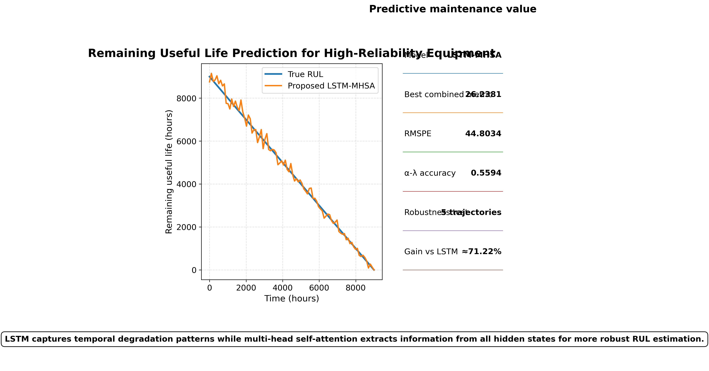
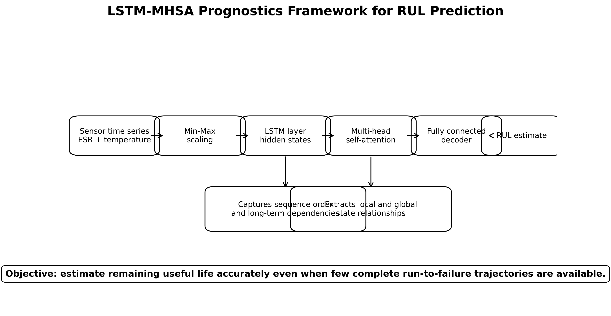
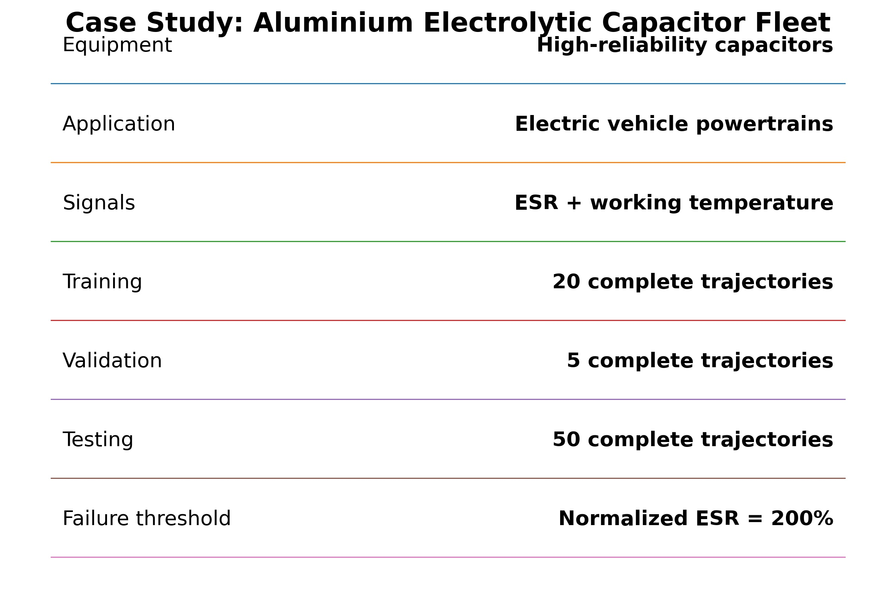
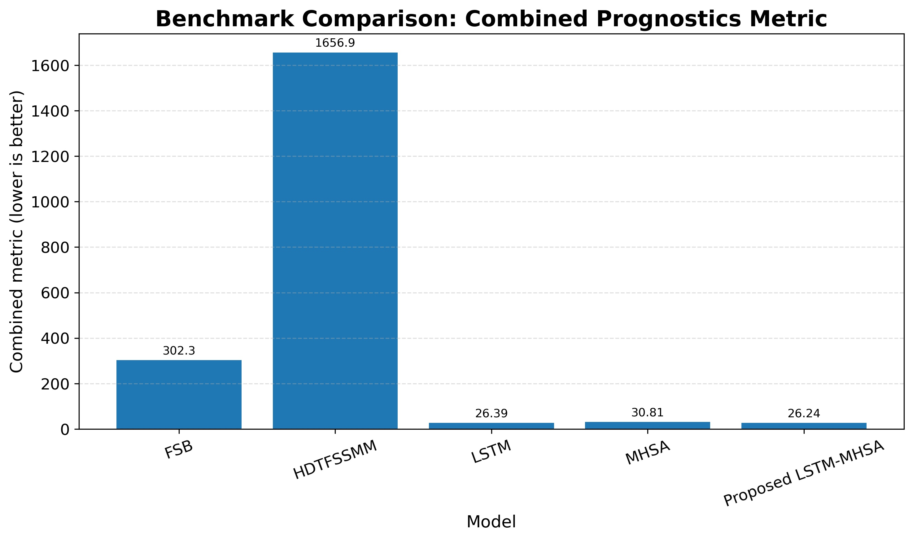
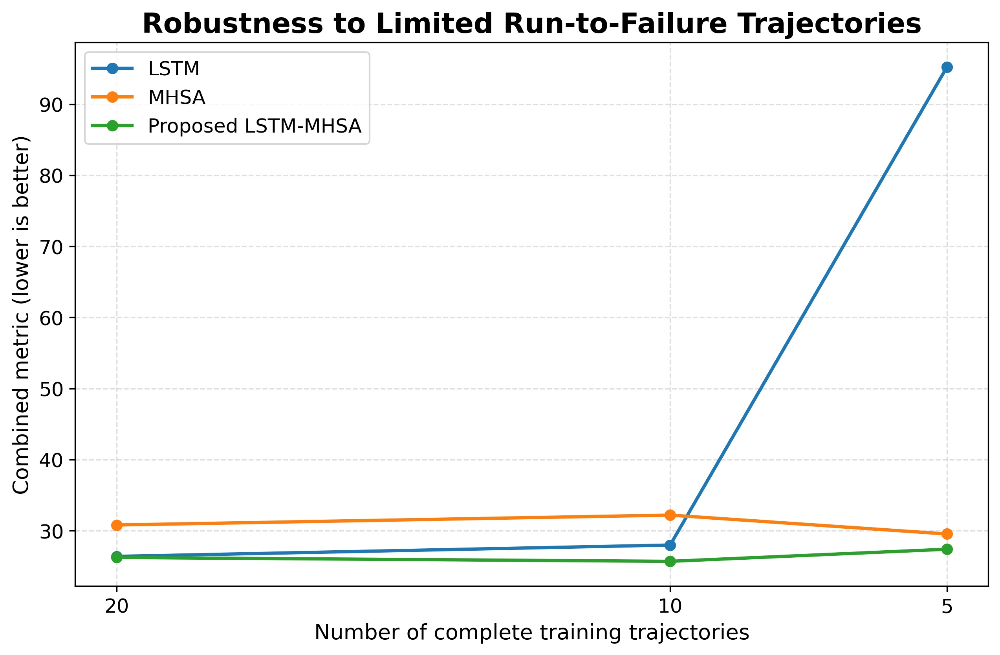

# Predictive Maintenance & Asset Reliability: RUL Prediction Using LSTM-MHSA

## Project overview

This repository presents a predictive maintenance and asset reliability case study based on the published paper:

**Al-Dahidi, S., Rashed, M., Abu-Shams, M., Mellal, M. A., Alrbai, M., Ramadan, S., & Zio, E. A novel approach for remaining useful life prediction of high-reliability equipment based on long short-term memory and multi-head self-attention mechanism. Quality and Reliability Engineering International. https://doi.org/10.1002/qre.3445**

The project demonstrates how **Long Short-Term Memory (LSTM)** and **Multi-Head Self-Attention (MHSA)** can be combined to predict the **Remaining Useful Life (RUL)** of high-reliability equipment.

The case study focuses on a simulated heterogeneous fleet of **aluminium electrolytic capacitors** used in electric vehicle powertrains. The objective is to support predictive maintenance by estimating how much useful life remains before failure.



## Business problem

High-reliability equipment often has few complete run-to-failure histories. This makes data-driven predictive maintenance difficult because deep learning models typically require enough failure examples to learn degradation patterns.

The business question addressed in this project is:

> Can a hybrid LSTM-MHSA model provide accurate and robust RUL predictions when only limited complete run-to-failure trajectories are available?

## Proposed solution

The proposed model combines:

- **LSTM** to capture sequential degradation patterns and long-term temporal dependencies.
- **Multi-Head Self-Attention** to extract information from all hidden states rather than relying only on the final LSTM state.
- **Fully connected layers** to convert learned features into a scalar RUL estimate.



## Case study

The case study simulates aluminium electrolytic capacitors working under variable operating and environmental conditions. Two signals are used:

- Equivalent Series Resistance (ESR)
- Working / aging temperature

The dataset structure includes:

| Dataset | Number of trajectories |
|---|---:|
| Training | 20 complete run-to-failure trajectories |
| Validation | 5 complete run-to-failure trajectories |
| Testing | 50 complete run-to-failure trajectories |



## Model evaluation

The proposed LSTM-MHSA model was compared with four benchmark models:

- FSB
- HDTFSSMM
- LSTM
- MHSA

The paper reports the following combined metric values, where lower is better:

| Model | Combined metric |
|---|---:|
| FSB | 302.2942 |
| HDTFSSMM | 1656.9 |
| LSTM | 26.3939 |
| MHSA | 30.8093 |
| Proposed LSTM-MHSA | 26.2381 |



## Robustness to limited data

The paper also evaluates robustness under different numbers of complete run-to-failure trajectories:

| Case | Training trajectories | Proposed combined metric |
|---|---:|---:|
| Case I | 20 | 26.2381 |
| Case II | 10 | 25.6985 |
| Case III | 5 | 27.4012 |

When only 5 complete training trajectories were available, the proposed model achieved a combined-metric performance gain of approximately **71.22%** compared with the LSTM model.



## Repository contents

```text
predictive_maintenance_rul_lstm_mhsa/
│
├── README.md
├── CITATION.cff
├── requirements.txt
│
├── docs/
│   ├── executive_summary.md
│   ├── methodology.md
│   ├── business_impact.md
│   └── limitations_and_future_work.md
│
├── figures/
│   ├── project13_rul_prediction_summary.jpg
│   ├── 01_lstm_mhsa_framework.jpg
│   ├── 02_benchmark_combined_metric.jpg
│   ├── 03_training_size_robustness.jpg
│   ├── 04_sample_rul_prediction_curve.jpg
│   └── 05_case_study_summary.jpg
│
├── data/
│   ├── benchmark_metrics.csv
│   ├── training_size_robustness.csv
│   ├── performance_gains.csv
│   ├── case_study_summary.csv
│   ├── life_fractions.csv
│   └── sample_rul_predictions.csv
│
└── notebooks/
    └── predictive_maintenance_rul_demo.ipynb
```

## Disclaimer

This repository is prepared for educational, research, and portfolio demonstration purposes. The included datasets are summary/demo files based on values reported in the published paper and are not raw industrial sensor data.
